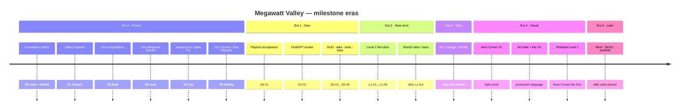
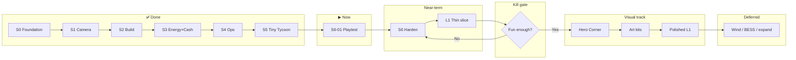

# Megawatt Valley — Development Timeline

**Status:** Living milestone map (sequence, not calendar dates)  
**Visual view:** open [`Docs/visuals/development-timeline.html`](visuals/development-timeline.html) in a browser  
**Sources:** `SESSION_GOALS.md`, `ROADMAP.md`, `CURRENT_STATUS.md`, `PRACTICES_AND_PLANNING.md`

Durations are intentionally **not** estimated in weeks. Progress is measured by celebration markers and session goals.

---

## You are here

```text
██████████ DONE ██████████│ NOW │░░░░ NEXT ░░░░│···· LATER ····
 Tiny Tycoon / First Playable │ S6-01 playtest │ Harden → L1 thin slice │ Hero Corner → expand
```

**Current focus:** `S6-01` — Rapha playtests `Prototype_Valley` on the home PC.

---

## Visual timeline (Mermaid)





---

## Era cards

| Era | Name | Status | Milestone outcomes |
| --- | --- | --- | --- |
| **0** | Foundation & Tiny Tycoon | ✅ Complete | Badges through First Playable; `Prototype_Valley` grey-box loop |
| **1** | Accept & Harden | ▶ Current | S6-01 playtest → S6-02 review → HUD / SO / tests / save |
| **2** | Level 1 thin slice | Queued | L1-01…L1-06; stretch = multi-site & 2★/3★ |
| **3** | Go / change / rethink | Gated | Invest in art only if thin-slice is fun |
| **4** | Hero Corner → polish | Later | V1→V6 visual checkpoints; 🎨 then 🌄 |
| **5** | Expansion systems | Deferred | Wind, BESS, portfolio, deep finance |

---

## Celebration markers

| Marker | State |
| --- | --- |
| 🏁 Foundation Online | ✅ |
| 🗺️ Valley Explorer | ✅ |
| 🔨 First Foundations | ✅ |
| ☀️ First Solar Farm | ✅ |
| ⚡ First Megawatt | ✅ |
| 💰 First Megawatt Earned | ✅ |
| 🔧 Keeping the Lights On | ✅ |
| 👷 Somebody Works Here | ✅ |
| 😂 That's Megawatt Valley | ✅ |
| ⭐ Tiny Tycoon | ✅ |
| 🎮 First Playable | ✅ |
| 🎨 Hero Corner | ☐ |
| 🌄 Here Comes the Sun | ☐ |

---

## Parallel visual track (does not replace gameplay eras)

```text
V0 Grey-box readability ──(now overlapping Era 0–2)──▶
V1 Hero Corner ──────────(after Era 3 yes)──────────▶
V2 Art bible + kits ────────────────────────────────▶
V3 L1 environment pass ─────────────────────────────▶
V4 Characters + activity ───────────────────────────▶
V5 UI / weather / VFX / audio ──────────────────────▶
V6 Polish benchmark ────────────────────────────────▶
```

Art tooling (Blender / Krita + Cursor) opens with Era 4 — see `CURSOR_BLENDER_KRITA.md`.

---

## How to update this timeline

1. When a celebration marker or S6/L1 goal completes, update this file, `SESSION_GOALS.md`, and `CURRENT_STATUS.md`.
2. Move the **You are here** chip in `visuals/development-timeline.html` to match.
3. Do **not** invent calendar deadlines unless Rapha explicitly sets them.
