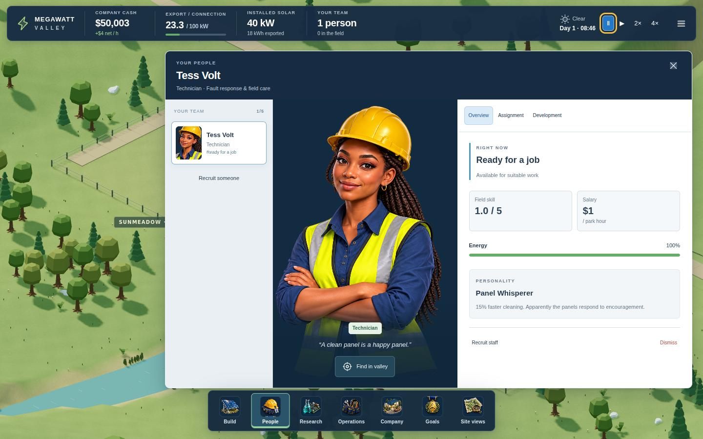
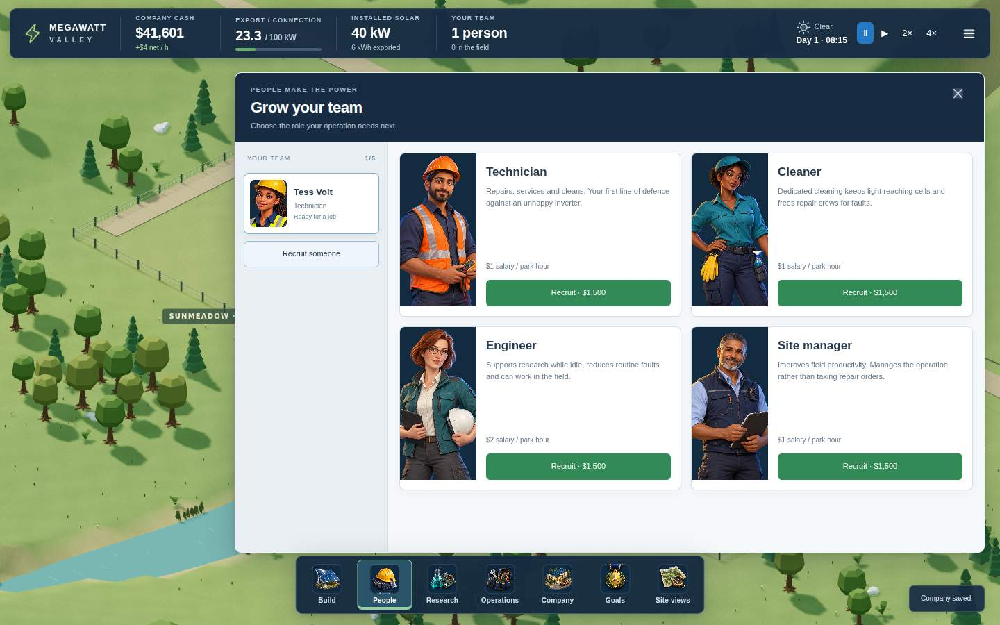
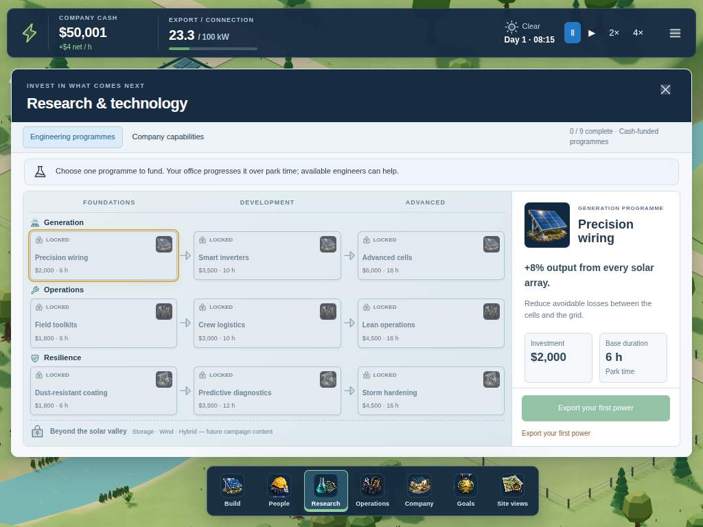
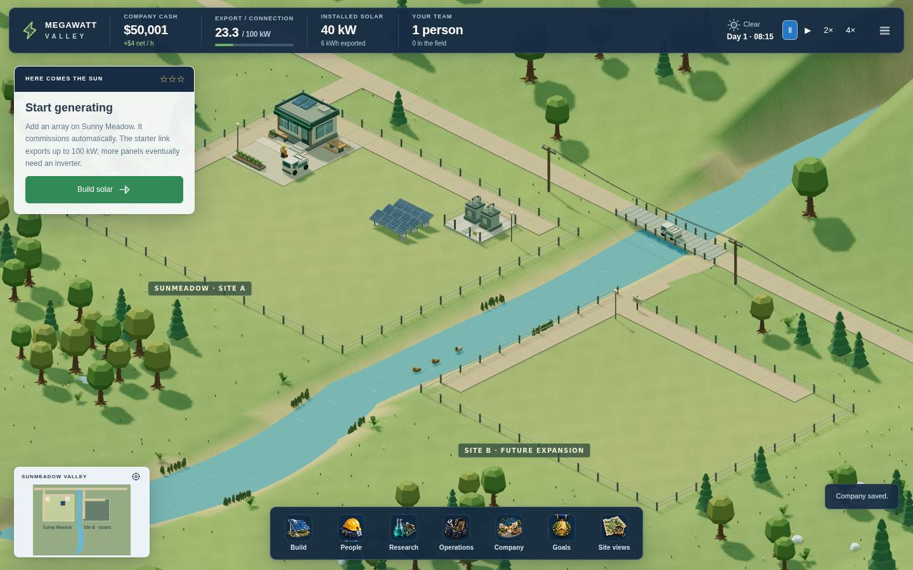

# UI artwork review — 9 October 2026

Tested runtime: `3b7be5eca6b8a1a2dcfb46be90dbffa8e24d5d30`.
[Windows build and download](https://github.com/Mr-Meow-ZA/Megawatt-Valley/actions/runs/37899566882) · [UI tests and complete screenshot evidence](https://github.com/Mr-Meow-ZA/Megawatt-Valley/actions/runs/37899566843).

These are actual running-game captures, not mockups. The code agent inspected them against [Concept v1](References/megawatt-valley-ui-ux-approved-concept-v1.jpg). This is agent visual review plus automated interaction testing, not an independent Cowork/human playtest or Rapha's approval.

## Changes and findings
- Five generated illustrated staff portraits replace the procedural UI busts; face crops identify roster members.
- Eight generated illustrations identify the main destinations and research families. Small controls use a commercially usable MIT Phosphor subset with its licence shipped.
- Initial screenshot review exposed research information pushed below the fold and recruitment buttons crowded by large portraits. The final build uses compact research artwork, keeps all nine nodes visible at 1024×768, and puts recruitment information/actions beside each portrait.
- Solar overview exposes capacity, current output and export headroom together. The formerly failing laptop comparison now keeps every trade-off row above the purchase footer.
- The valley and simulation are retained. Actual equipment previews continue to match the equipment placed in the world.

## Staff profile

## Recruitment
All four roles, salary and hiring actions are visible in the 1440×900 capture.

## Research at 1024×768
The fresh company has not earned its first unlock yet; grey nodes reflect that real state.

## Main HUD

## Verification exercised
81 simulation/data tests and production build passed. The full interaction suite exercised browsing/comparing/placing, road dragging/right-click cancellation/atomic rejection, staff hiring/training/assignment, research funding/progression, operations/policies, contracts, scenario event/save fixtures, new company, reload/import/export and responsive layouts. Added assertions cover local artwork decoding, complete recruitment cards and nine visible research nodes. No runtime/offline-network errors were reported.

The packaged Windows executable passed launch, isolated renderer, native saving, imported campaign, fullscreen, normal close/resume and corrupt-primary recovery. Installer/portable artifact: `MEGAWATT-VALLEY-3D-WINDOWS`, approximately 303 MB combined, expires 8 November 2026.

## Remaining quality work
The generated art has been inspected in context but is not product-owner approved. Broader UI feel, character/world style consistency and first-time play pacing still need independent play evidence. The small in-world staff models remain the existing 3D foundation; this work replaced UI portraits. Future asset work should start with the existing licensed library and a controlled proof of fit, not another broad replacement.
